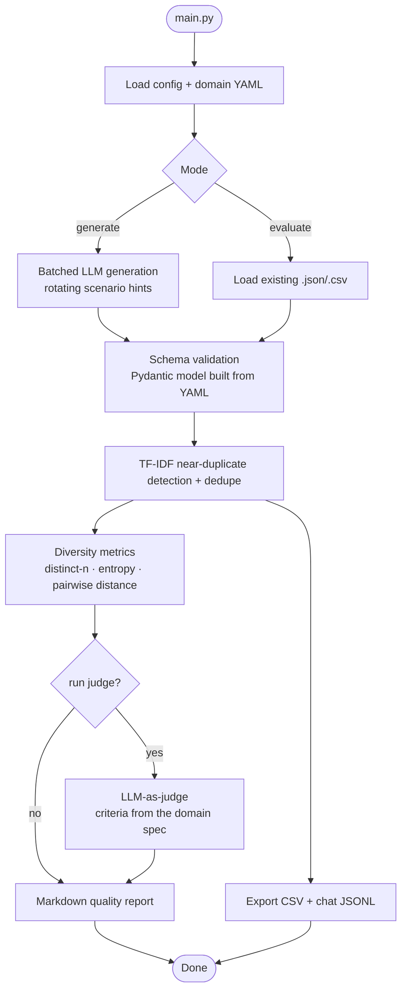

# Synthetic Data Factory

> Generate realistic, labeled synthetic datasets from a YAML spec — then validate, dedupe, score, and LLM-judge them into a fine-tuning-ready dataset with a quality report.


## Overview

Building or testing a data-labeling system needs realistic, varied, labeled data — and hand-writing it doesn't scale. **Synthetic Data Factory** generates that data with an LLM from a handful of seed examples, then runs it through a reusable quality harness that validates every record against a schema, removes near-duplicates, measures lexical and label diversity, and uses an LLM-as-judge to score realism and label fit. The output is a clean CSV, a fine-tuning-ready chat JSONL, and a Markdown quality report.

The defining design choice: **a dataset type is defined entirely in YAML** — fields, validation rules, generation prompts, judge criteria, and export templates. Adding a new domain takes zero Python. The repo ships flat domains (`support_tickets`, `product_reviews`) and a **relational, multi-table** domain (`marketplace`) that generates referentially-linked tables (sellers → buyers → offers → orders → line items) with foreign-key integrity and a queryable DuckDB export.

## Features

- **Config-driven domains** — schema, prompts, scenario hints, judge criteria, and chat-export mapping all live in one `config/domains/<name>.yaml`. A Pydantic model is built from the spec at runtime.
- **Relational (multi-table) generation** — an `entities` block defines FK-linked tables generated parents-first; IDs and foreign keys are assigned deterministically in Python (guaranteeing referential integrity) while the LLM fills only the content fields. Per-field distribution controls (enum weights, value choices, relative date ranges), `--scale`/`--count` sizing, and a queryable DuckDB export with `PRIMARY KEY`/`FOREIGN KEY` constraints.
- **Pool-and-recombine** — for `generate: llm` entities, the LLM authors a small pool of rows once and Python recombines them (sample-with-replacement) up to the required count, amortizing per-row API cost at scale. Configurable per entity (`pool:` block) or globally; `sample` mode keeps whole-row coherence, `shuffle` mode maximizes per-field variety. Kicks in only when the pool is smaller than the count, so small runs are untouched.
- **Scenario / edge-case injection** — a `scenarios:` list guarantees edge-case proportions in the output: select a slice by fraction, absolute count, or `at_least` minimum and overwrite fields with literals or distribution-configured values (e.g. "15% of orders in the returns window", "≥1 cancelled order"). Applied last and content-only (FK/id targets rejected at load) so referential integrity always holds — making the dataset a precise fixture for testing a consumer's branch logic.
- **Batched LLM generation** with rotating scenario hints for diversity; every record is schema-validated and short batches are topped up automatically.
- **Reusable, domain-agnostic quality harness** that works on *any* list of record dicts — synthetic or real labeled data:
  - Pydantic schema validation + per-field coverage
  - TF-IDF near-duplicate detection and greedy dedupe
  - Diversity metrics: distinct-n, vocabulary size, mean pairwise distance, per-label balance (normalized entropy)
  - LLM-as-judge scoring (criteria defined per domain) with flagged low-quality records
- **Two output formats** — dataset CSV and fine-tuning-ready chat JSONL (`{"messages": [...]}`), plus a Markdown quality report.
- **Runs offline** — `--evaluate` an existing dataset and/or `--no-judge` to exercise the whole harness with no API calls.
- **Tested** — 73 pytest tests, including the LLM stages exercised offline with mocked calls and the relational FK-integrity, pool-recombination, and scenario-injection guarantees.

## Architecture / How it works



The quality harness (`scripts/quality/`) is self-contained and depends on nothing about how the data was produced — point it at a real labeled export and it scores that just as well.

For **relational domains** (`mode: relational`), `scripts/relational.py` generates entities in dependency order, draws real parent IDs for every foreign key, denormalizes parent fields where a spec requests it, and verifies referential integrity before exporting CSVs, a single bundle JSON, and a constrained `.duckdb` file other projects can `JOIN` against directly. At scale, an LLM entity can author a small **pool** of rows and recombine them up to the requested count (cost amortization), and any entity can overlay **scenarios** that guarantee edge-case proportions — both applied with the seeded RNG, so a fully-synthetic run is byte-reproducible across seeds.

## Tech Stack

- **Language:** Python 3.12
- **Validation:** [pydantic](https://docs.pydantic.dev) 2.7 — schema built dynamically from the YAML spec
- **Quality metrics:** [scikit-learn](https://scikit-learn.org) 1.4 — TF-IDF + cosine similarity for dedup and diversity (dependency-light; swap in embeddings for a stronger semantic signal)
- **Data I/O:** [pandas](https://pandas.pydata.org) 2.2 · **Config:** [PyYAML](https://pyyaml.org) 6.0
- **Relational export:** [DuckDB](https://duckdb.org) 1.5 — writes the linked tables as a real schema with `PRIMARY KEY`/`FOREIGN KEY` constraints
- **LLM:** [langchain-openai](https://python.langchain.com) 0.2 against any **OpenAI-compatible** gateway (OpenAI, Azure OpenAI, a local server, or a corporate endpoint) — configured via env, no vendor lock-in
- **Testing:** pytest 8.2

## Getting Started

### Prerequisites
- Python 3.12 on PATH ([python.org](https://www.python.org/downloads/) — tick "Add Python to PATH" on Windows)
- An OpenAI-compatible LLM endpoint **only** for generation and the LLM-judge. Offline modes need none.

### Installation
```bash
git clone https://github.com/Drzymek92/synthetic-data-factory.git
cd synthetic-data-factory
python -m venv .venv
.venv\Scripts\activate            # Windows  (source .venv/bin/activate on macOS/Linux)
pip install -r requirements.txt
cp config/.env.example config/.env   # then fill in LLM_BASE_URL / LLM_MODEL / LLM_API_KEY
```

### Usage
```bash
# Generate 50 support tickets, evaluate, and export (needs an LLM endpoint)
python scripts/main.py --n 50

# Pick the other shipped domain
python scripts/main.py --domain product_reviews --n 50

# Evaluate an existing dataset, fully offline (no API calls)
python scripts/main.py --evaluate path/to/data.json --no-judge

# Relational domain: generate FK-linked tables + a queryable DuckDB file
python scripts/main.py --domain marketplace --count sellers=8 buyers=20 offers=30 orders=50

# Scale every entity count up/down at once
python scripts/main.py --domain marketplace --scale 5
```

| Flag | Purpose |
|---|---|
| `--domain <name>` | Use `config/domains/<name>.yaml` (default: `support_tickets`) |
| `--n <int>` | Number of records to generate (flat domains) |
| `--model <name>` | Override the LLM model |
| `--evaluate <path>` | Evaluate an existing `.json`/`.csv` instead of generating |
| `--no-judge` | Skip the LLM-as-judge stage (no API calls) |
| `--judge-sample <int>` | Judge only N sampled records (cost control) |
| `--scale <float>` | (relational) multiply every top-level entity count |
| `--count <entity=N ...>` | (relational) override specific entity counts, e.g. `--count offers=200 orders=5000` |
| `--no-duckdb` | (relational) skip the `.duckdb` export (CSV + bundle JSON still written) |
| `--smoke` | One tiny live call to verify gateway connectivity + credentials, then exit |
| `--config <path>` | Path to the global config YAML |

### Adding a new domain (zero Python)
Copy `config/domains/support_tickets.yaml` to `config/domains/<your_domain>.yaml`, edit the `fields`, `generation`, `judge`, and `chat_export` blocks, drop a seed file in `scripts/inputs/`, and run with `--domain <your_domain>`.

## Sample run

```text
$ python scripts/main.py --domain product_reviews --evaluate scripts/inputs/seed_reviews.json --no-judge
2026-06-15 17:57:12 | INFO | Pipeline started (domain: product_reviews)
2026-06-15 17:57:12 | INFO | Loaded 2 records from scripts/inputs/seed_reviews.json
2026-06-15 17:57:12 | INFO | Evaluating 2 records (domain: product_reviews)
2026-06-15 17:57:12 | INFO | Validation: 2 valid, 0 rejected
2026-06-15 17:57:12 | INFO | Dedup: 0 near-duplicate pairs, 0 removed
2026-06-15 17:57:12 | INFO | Diversity: distinct_2=0.9651
2026-06-15 17:57:12 | INFO | Wrote dataset CSV: scripts/outputs/product_reviews_cleaned_20260615_175712.csv
2026-06-15 17:57:12 | INFO | Wrote fine-tuning chat JSONL (2 examples): scripts/outputs/product_reviews_cleaned_chat_20260615_175712.jsonl
2026-06-15 17:57:12 | INFO | Wrote report: scripts/outputs/quality_report_20260615_175712.md
2026-06-15 17:57:12 | INFO | PASS — 2 clean records.
2026-06-15 17:57:12 | INFO | Pipeline completed successfully
```

The quality report includes per-field coverage bars, near-duplicate counts, diversity metrics, per-label balance, and (when the judge runs) per-dimension scores with flagged records.

## Project Structure

```
synthetic-data-factory/
├── config/
│   ├── default.yaml              # global knobs + active domain
│   ├── .env.example
│   └── domains/
│       ├── support_tickets.yaml  # flat domain spec
│       ├── product_reviews.yaml
│       ├── marketplace.yaml      # relational (multi-table, FK-linked) domain
│       └── marketplace_offers.yaml
├── scripts/
│   ├── main.py                   # pipeline entry point (flat + relational)
│   ├── config.py                 # YAML + CLI overrides -> typed AppConfig
│   ├── domain.py                 # builds the Pydantic schema from a domain spec
│   ├── generator.py              # batched LLM generation
│   ├── relational.py             # multi-table generation + FK integrity + DuckDB export
│   ├── export.py                 # CSV + chat JSONL formatters
│   ├── llm_client.py             # OpenAI-compatible gateway client
│   ├── quality/
│   │   ├── validation.py         # schema validation + field coverage
│   │   ├── dedup.py              # TF-IDF near-duplicate detection
│   │   ├── diversity.py          # distinct-n, entropy, pairwise distance
│   │   ├── judge.py              # LLM-as-judge (criteria from the domain spec)
│   │   └── report.py             # Markdown quality report
│   └── inputs/                   # few-shot seed files
└── tests/                        # 73 pytest tests
```

## License

This project is licensed under the MIT License — see [LICENSE](LICENSE).
